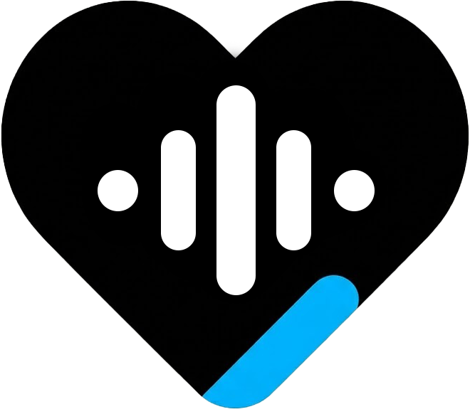
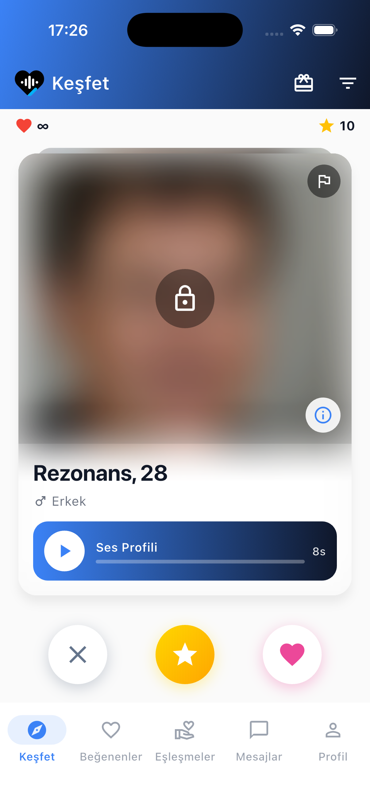
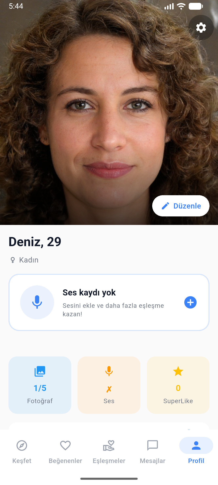
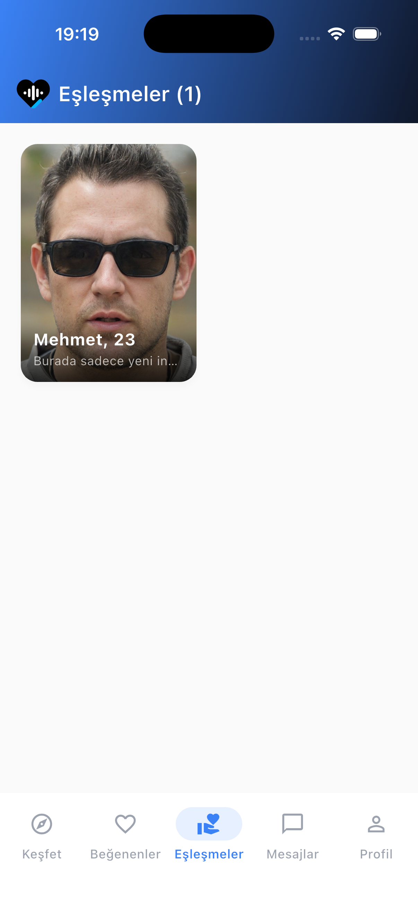
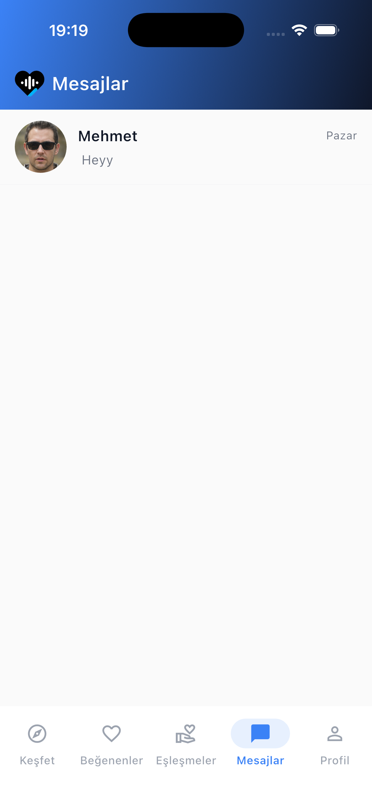

# 🎵 Rezonans — Sesle Tanış, Gerçek Bağlantılar Kur

  

  <strong>Sesi duyduğunda kalbin çarpıyorsa, doğru kişiyi buldun demektir.</strong>

  
  
  
  

---

## 📖 Uygulama Hakkında

**Rezonans**, fotoğraf odaklı tanışma uygulamalarının aksine sizi gerçekten yansıtan şeye odaklanır: **sesinize ve müzik zevkinize.** 

Her kullanıcı kısa bir ses profili kaydeder. Eşleşme gerçekleşmeden önce fotoğraflar bulanık kalır. Böylece sizi gerçekten tanımak isteyen kişilerle tanışırsınız — görünüşe değil, enerjinize çekilenlerle.

---

## ✨ Öne Çıkan Özellikler

### 🎤 Ses Profili
- **5 Saniyelik Ses Tanıtımı**: Kendinizi sesinizle ifade edin
- Dalga formu görselleştirmesiyle ses oynatma
- Ses öncelikli eşleştirme algoritması

### 💖 Akıllı Eşleştirme
- **Swipe Sistemi**: Sağa kayan = Beğendim, Sola kayan = Geç
- **Karşılıklı Eşleşme**: Sohbet yalnızca her iki taraf beğendiğinde açılır
- **Süper Beğeni**: Birinin dikkatini özellikle çekmek istiyorsan kullan
- **Fotoğraf Gizliliği**: Eşleşme sonrası fotoğraflar görünür hale gelir

### 💬 Gerçek Zamanlı Sohbet
- Anlık metin mesajlaşma
- Sesli mesaj gönderme
- Tek görüntüleme fotoğraf paylaşımı
- Yazıyor... göstergesi ve okundu bilgisi

### 🎯 Gelişmiş Filtreler
- Yaş aralığı seçimi
- Mesafeye göre eşleştirme
- Müzik türü tercihleri
- Ses tonu ve karakter tercihleri

### 🎁 Ödül Sistemi
- Günlük ve etkinlik bazlı ödüller kazan
- **Süper Beğeni**, **Boost** ve **Premium Gün** ödülleri
- Uygulamayı kullandıkça sürpriz hediyeler

### 🌟 Süper Beğeni Sistemi
- Özel ilgini göster, profilinde öne çık
- Karşı taraf senin süper beğendiğini anında görür
- Günlük beğeni limitlerinden bağımsız

### 🌍 Çoklu Dil Desteği
- Türkçe ve İngilizce arayüz
- Sistem diline göre otomatik seçim

### 🌙 Tema Desteği
- Açık (Light) ve koyu (Dark) mod
- Göz yormayan modern tasarım

---

## 📸 Ekran Görüntüleri

  
  
  
  

---

## 🎮 Nasıl Çalışır?

### 1️⃣ Profilini Oluştur
1. Email, Google veya Apple ile kaydol
2. Birkaç fotoğraf yükle
3. **5 saniyelik ses tanıtımını** kaydet
4. Müzik zevkini ve ilgi alanlarını belirt

### 2️⃣ Keşfet
- Sana önerilen profilleri dinle
- Sağa kaydırarak beğen, sola kaydırarak geç
- Özel birini gördüysen Süper Beğeni kullan

### 3️⃣ Eşleş
- Karşılıklı beğeni = **Eşleşme!**
- Eşleşme anında bildirim al
- Artık fotoğraflar görünür hale gelir

### 4️⃣ Sohbet Et
- Metin veya sesli mesaj gönder
- Anlık fotoğraf paylaş (tek görüntüleme)
- İlişkini ilerlet!

---

## 💎 Premium Avantajları

| Özellik | Ücretsiz | Premium |
|---|:---:|:---:|
| Günlük Beğeni | Sınırlı | Sınırsız |
| Süper Beğeni | Günde 1 | + Ödüllerden kazan |
| Seni Beğenenleri Gör | Bulanık | Açık |
| Gelişmiş Filtreler | ❌ | ✅ |
| Boost (Öne Çık) | ❌ | ✅ |
| Reklam | Var | Yok |
| Sohbet Önceliği | ❌ | ✅ |

**Aylık** · **3 Aylık** · **Yıllık** plan seçenekleri mevcuttur.

---
## 🔒 Güvenlik & Gizlilik

Kullanıcı güvenliği Rezonans'ın en önemli önceliğidir:

- ✅ **Anonim Başlangıç**: Eşleşmeden önce fotoğraflar gizli
- ✅ **KVKK Uyumlu**: Türk veri koruma mevzuatına tam uyum
- ✅ **Şifreli Bağlantı**: Tüm veri iletimi SSL/TLS ile korunur
- ✅ **Engelleme & Raporlama**: Rahatsız edici kullanıcıları anında engelle
- ✅ **Konum Gizliliği**: Tam konum yerine yalnızca yaklaşık mesafe
- ✅ **İki Faktörlü Doğrulama**: Hesap güvenliği için ekstra koruma
- ✅ **Veri Silme**: İstediğin zaman hesabını ve tüm verilerini silebilirsin

Detaylı bilgi için aşağıdaki **Yasal** bölümünden dilinize uygun Gizlilik Politikası sayfasını inceleyebilirsiniz.

---

## 📱 Sistem Gereksinimleri

| Platform | Minimum Versiyon |
|---|---|
| iOS | 15.0 ve üzeri |
| Android | 8.0 (API 26) ve üzeri |

---

## 🛠️ Teknoloji Altyapısı

> *Geliştiriciler için*

- **Framework**: Flutter (Dart)
- **Backend**: Supabase (PostgreSQL, Realtime, Storage)
- **Bildirimler**: Firebase Cloud Messaging
- **Analitik**: Firebase Analytics
- **Abonelik**: RevenueCat
- **Mimari**: Clean Architecture + BLoC/Cubit
- **Bağımlılık Yönetimi**: GetIt + Injectable

---

## 🆘 Destek & İletişim

Sorularınız, önerileriniz veya bir sorunla karşılaştınız mı?

📧 **E-posta**: furkanpala404@gmail.com

Genellikle **24 saat** içinde yanıt veriyoruz.

---

## ⚖️ Yasal

### 🔒 Gizlilik Politikası (Privacy Policy)

Farklı bölgelerdeki kullanıcılarımız için Gizlilik Politikası dosyalarımıza aşağıdan ulaşabilirsiniz:

| Dosya | Dil | Kod |
|---|---|---|
| [PRIVACY_tr.md](legal/privacy/PRIVACY_tr.md) | Türkçe | `tr-TR` |
| [PRIVACY_en.md](legal/privacy/PRIVACY_en.md) | English (U.S.) | `en-US` |
| [PRIVACY_es.md](legal/privacy/PRIVACY_es.md) | Español (España) | `es-ES` |
| [PRIVACY_ar.md](legal/privacy/PRIVACY_ar.md) | العربية | `ar-SA` |
| [PRIVACY_de.md](legal/privacy/PRIVACY_de.md) | Deutsch | `de-DE` |
| [PRIVACY_fr.md](legal/privacy/PRIVACY_fr.md) | Français | `fr-FR` |
| [PRIVACY_pt.md](legal/privacy/PRIVACY_pt.md) | Português (Portugal) | `pt-PT` |

### 📋 Kullanım Koşulları (Terms of Service)

| Dosya | Dil | Kod |
|---|---|---|
| [TERMS_tr.md](legal/terms/TERMS_tr.md) | Türkçe | `tr-TR` |
| [TERMS_en.md](legal/terms/TERMS_en.md) | English (U.S.) | `en-US` |
| [TERMS_es.md](legal/terms/TERMS_es.md) | Español (España) | `es-ES` |
| [TERMS_ar.md](legal/terms/TERMS_ar.md) | العربية | `ar-SA` |
| [TERMS_de.md](legal/terms/TERMS_de.md) | Deutsch | `de-DE` |
| [TERMS_fr.md](legal/terms/TERMS_fr.md) | Français | `fr-FR` |
| [TERMS_pt.md](legal/terms/TERMS_pt.md) | Português (Portugal) | `pt-PT` |

### 🛡️ Çocuk Güvenliği Politikası (Child Safety / CSAE Policy)

| Dosya | Dil | Kod |
|---|---|---|
| [CSAE_POLICY_tr.md](legal/CSAE_POLICY_tr.md) | Türkçe | `tr-TR` |
| [CSAE_POLICY_en.md](legal/CSAE_POLICY_en.md) | English (U.S.) | `en-US` |

> Özet için: [CSAE_POLICY.md](legal/CSAE_POLICY.md)

### 🗑️ Hesap Silme (Account Deletion)

- [ACCOUNT_DELETION.md](legal/ACCOUNT_DELETION.md)

---

  <strong>Rezonans ile sesiniz sizi tanıştırsın.</strong>

  © 2025–2026 Rezonans. Tüm hakları saklıdır.

